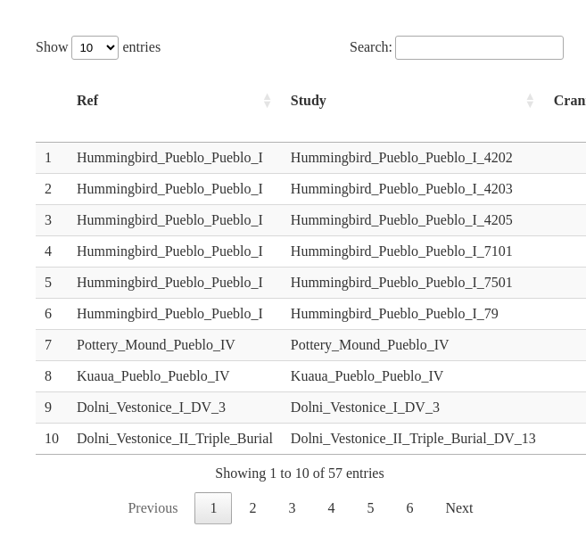
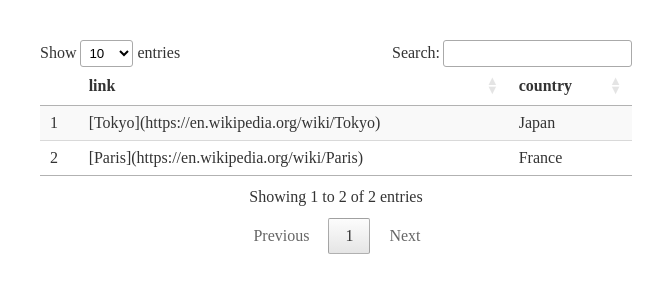
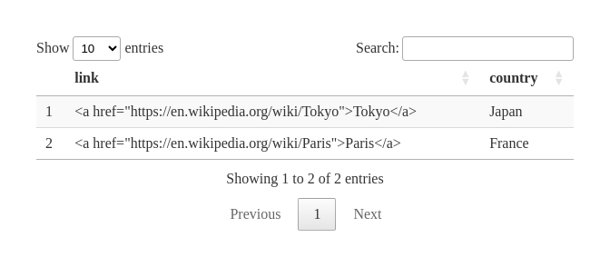
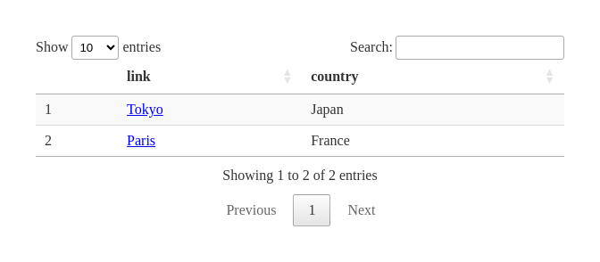

Reconstrucción de Egeland et al., 2018: ‘Hominin skeletal part
abundances…’
================
Antonio Canepa-Oneto
Last compiled on 14 junio, 2023

## Introducción

Se hace una mini-revisión de lo reportado en *Hominin skeletal part
abundances and claims of deliberate disposal of corpses in the Middle
Pleistocene* <https://doi.org/10.1073/pnas.1718678115>

Los procesos funerarios humanos tiene una antiguedad determinada (desde
cuándo somos conscientes de nuestra muerte) que está bajo escrutinio y
constante debate. Gracias a un estudio de diversos yacimientos se
intenta esclarecer ese posible supuesto de primer origen de
enterramientos funerarios para los yacimientos de Atapuerca (**SH**) y
Sudáfrica (**DC**).

Cuando se encuentra y analiza un yacimiento de homínidos (u homininos
para ser más precisos) es posible que no todos los huesos estén en
perfecto estado y más notable aún es posible que no todos los huesos
estén presentes. La ausencia de determinados huesos puede deberse a
procesos aleatorios (deterioro, rompimiento, etc), semi-aleatorios
(consumo de carroña de partes específicas) o altamente selectivos (ritos
funerarios).

Afortunamente existe una cantidad interesante de yacimientos con restos
humanos y de primates (“cercanos”) que pueden dar pistas de si los
yacimientos **SH** y **DC** pueden (o no) considerarse procesos rituales
(muy específicos) o simplemente procesos aleatorios y/o semi-aleatorios.

### Objetivos

Los objetivos del artículo son tratar de comparar los yacimientos de
**SH** y **DC** con yacimientos conocidos para determinar si la
estructura (como composición unitaria, no como forma) de huesos
disponibles es ás característico de un rito funerario o de un proceso de
pérdida aleatorio (descomposición) o semi-aleatorio (carroña).

### Diseño de Análisis

La idea general es que ellos comparan los huesos encontrados (“*Hominin
skeletal part representation* - **HSPR**”) con otros 14 yacimientos
entre los cuales existen algunos de humanos en estado “completo” en el
que no le falta ninguna pieza.

Para eso ellos:

1.- Usando un Random Forest (RF) determinan cuáles son las piezas de
huesos con más variabilidad (Gini idex y MDA), para utilizarlas luego en
la creación/clasificación de grupos.

2.- Usando un primer k-means logran crear dos grupos de “HSPR”, en los
que los huesos humanos “completos” y otros yacimientos en buen estado
quedan juntos en un cluster y el segundo cluster atribuyen a carroña,
canibalismo, etc. mostrando un proceso de acumulación natural (**no
ritual**).

3.- Repiten el k-means con más grupos y encuentran un gradiente de
conservación de 4 grupos desde los más completos hasta los netamente
depredados/erosionados.

4.- Usando herramientas supervisadas intentan clasificar los yacimientos
(todos) con especial interés en **SH** y **DC** en alguno de los grupos
ya reconocidos por los k-means anteriores.

5.- Usando herramientas no-supervisadas intentan agrupar los yacimientos
(todos) con especial interés en **SH** y **DC** para ver si coinciden
con las características/grupos encontradas en los k-means anteriores.

El conjunto de datos se entrega de manera desagregada, dificultando los
análisis por lo que he procedido a recopilarlo todo en un único
documento. El documento original entregado como “material suplementario”
se puede encontrar
[aquí](https://www.pnas.org/doi/suppl/10.1073/pnas.1718678115/suppl_file/pnas.1718678115.sd01.xlsx).

El connjunto de datos recopilado (solo las primeras 15 filas) se muestra
a continuación:

``` r
datatable(Summary_Dataset)
```

<!-- -->

### Tratamiento estadístico de datos de partes esqueléticas de primates

Todos los análisis descritos a continuación se ejecutan dentro del
entorno estadístico R

Los algoritmos implementados, el paquete utilizado y la URL de esos
paquetes se enumeran en la siguiente tabla:

### Análisis somero del material suplementario

Aquí se destacan algunos puntos clave del documento mismo.

El objetivo del análisis exploratorio es doble: (i) identificar el
número óptimo de grupos representados por los ensamblajes de homínidos y
(ii) determinar la pertenencia de cada grupo identificado. Muchos
algoritmos de agrupación tienden a funcionar mal cuando, como es el caso
aquí, el número de variables (elementos esqueléticos = 23) excede
sustancialmente el tamaño de la muestra (ensamblajes de homínidos = 16).
Para abordar esta discrepancia, utilizamos un análisis de RF en los 16
ensamblajes, incluidos SH y DC, para identificar un subconjunto de
elementos esqueléticos que es más pequeño que el tamaño de la muestra y
explica la mayor cantidad de variación (120). Para identificar el número
óptimo de grupos representados por los 16 ensamblajes, los elementos
esqueléticos con un valor de MDA \> 5 después de la generación de 500
árboles se ingresan en la biblioteca R “NbClust”, que ejecuta y combina
30 algoritmos de agrupamiento diferentes. Luego, un análisis de k-medias
clasifica cada uno de los conjuntos comparativos en uno de los grupos
reconocidos por las funciones NbClust. La fuerza de la asignación de
grupos se evalúa con la función gráfica “clusplot”, que proporciona
elipses y gráficos de silueta con un 95 % de confianza, que estiman el
valor s(i) de cada conjunto comparativo. Una comparación de distancias
dentro y entre grupos da como resultado valores de s(i) que van desde 1
(clasificación fuerte dentro de un grupo) hasta 0 (clasificación
parsimoniosa pero débil dentro de un grupo). Esta clasificación
preliminar establece un marco para la aplicación de una variedad de
métodos de aprendizaje automático que pueden identificar los ensamblajes
comparativos que mejor coinciden con las concentraciones de homínidos de
SH y DC.

Antes de la construcción del modelo, todos los datos de las partes del
esqueleto se someten a una transformación de centro y escala

Para elegir el mejor modelo para el análisis, utilizamos el remuestreo
de validación cruzada con exclusión de grupo de Monte-Carlo. Esto crea
múltiples divisiones de conjuntos de entrenamiento/conjuntos de prueba y
es más sólido con muestras pequeñas que los métodos de validación
cruzada de bootstrapping, bagging y k-fold.

Los modelos producidos por cada método de aprendizaje automático después
de 30 iteraciones se evalúan con κ de Cohen.

Finalmente, realizamos una CA no supervisada con puntajes de carga de
PCA.

### Pasos a seguir y algunas ideas

Aseguran que los huesos de *SH* presentan mucha perturbación (tipo
carroña) y por ende no podrían ser clasificados como rito mortuorio. Sin
embargo no muestran un análisis detallado de los rastros de “huellas” de
carroñeo que presentan ni los datos que (entiendo) posee el grupo de
Nohemí.

Quizás a nivel de Algoritmo (como tal) no se puede indagar mucho (porque
probablemente muestren algo similar), pero sí a nivel de incluir datos
nuevos que no estén incluidos y ya sea repitiendo la aproximación de
ellos o agregando alguna nueva, los resultados sean diferentes apoyando
(esta vez) la idea de que los restos en **SH** están allí por un acto
“ritual de muerte” y no por simple acumulación transporte.

``` r
example.df.kable <- data.frame("link"=c("[Tokyo](https://en.wikipedia.org/wiki/Tokyo)","[Paris](https://en.wikipedia.org/wiki/Paris)"), "country"=c("Japan","France"))
```

``` r
example.df.datatable <- data.frame("link"=c(
'<a href="https://en.wikipedia.org/wiki/Tokyo">Tokyo</a>',
'<a href="https://en.wikipedia.org/wiki/Paris">Paris</a>'),
"country"=c("Japan","France"))
```

``` r
kable(example.df.kable)
```

| link                                         | country |
|:---------------------------------------------|:--------|
| [Tokyo](https://en.wikipedia.org/wiki/Tokyo) | Japan   |
| [Paris](https://en.wikipedia.org/wiki/Paris) | France  |

``` r
datatable(example.df.kable)  # This does NOT show the links
```

<!-- -->

``` r
datatable(example.df.datatable)  # This does NOT show the links
```

<!-- -->

``` r
datatable(example.df.datatable, escape=FALSE)  # This does show the links
```

<!-- -->
