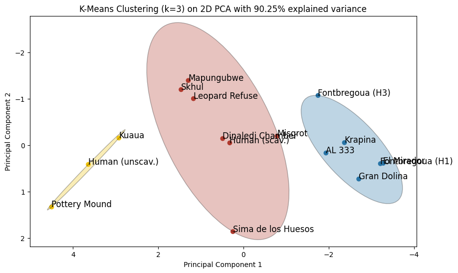

# Unsupervised

**Objective:** Study whether part abundance or the absent of bones
abundance, can give use hints about the origin of bone assemblages, i.e.
help to identify patterns or anomalies in skeletal part representation
to offer insights into the practices of hominin disposal, or
post-depositional processes affecting the assemblages.

### Definitions

**Abundance**: is defined as the number of skeletal elements recovered
divided by the number of elements expected *(Both complete and damaged
bones are included in the element counts)*. (Hag. PhD Thesis 91)

It can be quantified using the following formula: $$
\text{Abundance} = [\text{Part Abundance}_1, ...,\text{Part Abundance}_n], \  \text{with} \  n = |\text{Distinct Skeletal Parts} |
$$ and $$
\text{Part Abundance}_i = \frac{\text{Number of Recovered Elements}_i}{\text{Number of Expected Elements}_i}, \ \forall i \in \{ 1, ..., n \}.
$$ Where:

-   **Number of Recovered Elements** is the count of a specific type of
    skeletal element (e.g., femur, skull) that has been recovered from
    the archaeological site. This includes both complete and damaged
    bones.

<!-- -->

-   **Number of Expected Elements** is the estimated total count of that
    specific type of skeletal element that would be expected to be found
    in a typical assemblage of the same context or period.

**Mean abundance(MA):** is the average number of skeletal elements
observed per archaeological assemblage, normalized against the expected
count of such elements.

This metric is calculated by taking the sum of the abundance values
across all observed skeletal elements and dividing by the total number
of elements within the sample. In formulaic terms: $$
\text{Mean Abundance} = \frac{\sum (\text{Observed Abundance of Each Element})}{\text{Total Number of Elements in Sample}}
$$ Where:

-   **Observed Abundance of Each Element** is the number of skeletal
    elements recovered (including both complete and damaged bones) for
    each type of element.
-   **Total Number of Elements in Sample** is the count of all skeletal
    elements (of all types) that were expected to be found in the
    archaeological assemblage.

**Mean Part Abundance (MPA):** The Mean Part Abundance (MPA) is the
average abundance of all individual skeletal parts within an
archaeological assemblage.

It is calculated by first determining the abundance of each distinct
skeletal part (as per the existing definition of abundance), and then
computing the arithmetic mean of these abundance values. The formula for
MPA is as follows: $$
\text{Mean Part Abundance} = \frac{\sum (\text{Abundance of Each Skeletal Part})}{\text{Number of Distinct Skeletal Parts}}
$$ Where: - **Abundance of Each Skeletal Part** is the number of
individual skeletal elements of a specific type (e.g., femur, skull)
recovered, divided by the number of such elements expected. - **Number
of Distinct Skeletal Parts** is the total count of different types of
skeletal parts included in the analysis.

------------------------------------------------------------------------

#### Definitions:

**MNI**: Minimum Number of Individuals

**MNE**: Minimum Number of Elements

**MAU**: Minimum Animal Units

**MNAU**: Minimal Number of Anatomic Units

**%MAU**: MAU divided by max(MNE)

**%MNAU**: MNAU divided by max(MNI)

**ReMNAU**: Relative MNAU = ReMNAU = $|| MNAU||_1$

**Accumulative ReMNAU** : $$
AcReMNAU_{i+1} = AcReMNAU_i + ReMNAU_{i+1}
$$

\$\$

```{=tex}
\begin{split} \text{ReMAUI} & =||\text{MAUI} ||_1 =\text{Manhatten-Norm}(\frac{\text{MAU}}{\text{max(MNI)}}) \\ \\

&  = \frac{ \frac{MAU}{max(MNE)}}{\sum \frac{MAU}{max(MNE)}} 
     = \frac{MAU}{\sum MAU}
   = \frac{ \frac{MAU}{max(MNI)}}{\sum \frac{MAU}{max(MNI)}} \\ \\
   & = \frac{MNAU}{\sum MNAU} =||MNAU||_1 = ReMNAU \end{split}
```
\$\$

------------------------------------------------------------------------

**Datasets:**

Based on the supplementary Information of the Pnas. We created 6
different datasets, based on 3 methods and for each method we created
the *raw* version, i.e. the complete Pnas dataset and the *used* version
with only based on the columns "MNE" and"%MAU" of the "All hominins"
section. We created the 6 dataset based on 3 methods.

**Method 1 (%MAU):** As the Pnas, we used the "%MAU" column to create
two data set. One with all 36 sample and one with only the 16 sample use
in the final analysis of the Pnas.

**Method 2 (%MNAU):** We took the all hominin MAU row and divided each
by it's corresponding number of Individuals based on the literature.

**Method 3 (ReMNAU):** We took the all hominin MAU row and divided each
though the column sum.

**Features:**

We added the number of Individuals which are estimated to comprise the
each part abundance sample, ie $$
\text{Individuals} = max([\text{MNI}_1, ..., \text{MNI}_n]),
$$ which we will call *sample* or *total MNI* interchangeably,
throughout.

**Labels:**

To all dataset we added two labels "Type" and "AccumulationType". The
"Type" label is based on the Pnas labels: 'Primary hominin interment',
'Possible Primary hominin interment', 'Possible hominin deliberate
disposal', 'Hominin cannibalism/ secondary interment', 'Nonanthropogenic
hominin accumulation', 'Natural Baboon accumulation', 'Unscavenged human
corpses', 'Scavenged human corpses' and 'Leopard refuse'.

The 'AccumulatioType' label is a *preliminary* type categorization for
the intent of working with less labels, for primarily for a possibly
intent of and supervised analysis of multiclass classification (since 16
samples with 8 labels and min(labels) = 1, not feasible):

**Burial (14):** Primary hominin interment (5) Possible Primary hominin
interment (9)

**Cannibalism (10):** Hominin cannibalism/secondary interment (10)

**Non-human/non-carnivore intervention/accumulation (7):**
Non-anthropogenic hominin accumulation (5) Natural Baboon accumulation
(1) Unscavenged human corpses (1)

**Carnivore intervention (5):** Leopard refuse (2) Scavenged human
corpses (3)

Furthermore, we added the **Pnas_Cluster** label to each *used*
16-sample sized datasets the cluster names found by the Pnas paper, with
K=3 (respectively K=4):

Pnas_Cluster A, ​ Pnas_Cluster B (respectively Pnas_Cluster B1 &
Pnas_Cluster B2) and ​ Pnas_Cluster C.

**Data prepartaion**

-   By taking the columns with "-"/empty fields from the original Pnas
    dataset we ended up with non numeric columns. We converted "-" to
    "NaN's" and non-numeric columns back to numeric columns.\
-   Since we are missing the definite hand and foot bone separation for
    some samples (Human (Un)scavenged) we chose to work with "Hand
    (metacarpals + manual phalanges)" and "Foot (metatarsals + pedal
    phalanges)" and dropped the columns ""Metacarpal", "Metatarsal",
    "Hand.phalanx", "Foot.phalanx" (similar to PNAS paper).

------------------------------------------------------------------------

## Reply Pnas

Recognizing the visible importance of the absolute Mean Part Abundance
(MPA) of the dataset, by visualizing the percentage of Minimum Animal
Units (%MAU) for each sample and skeletal part, we opted to adapt the
methodology used in the PNAS paper, focusing our analysis exclusively on
the Mean Part Abundance for each sample.

To align the analysis with the original PNAS study, which used a k-means
clustering approach with among K=3, we can now manually re-cluster the
samples into the same Pnas_Clusters by arranging the samples in order of
their absolute MPA and then segmenting them into three distinct
clusters, choosing the split between "Kuaua" and "Scavenged_human" and
between "Misgrove Cave" and "Krapina"(Table 1):


The approach to re-cluster of the samples based on their absolute Mean
Part Abundance (MPA), we followed the methodology outlined in the PNAS
study. This involved standardizing the data by centering it to a mean of
zero and rescaling to ensure a standard deviation of one.

Following this data standardization, we employed the k-means clustering
algorithm, setting the number of clusters (K) to 3. To ensure the
reproducibility of our results, we used a random_state value of 42.
Additionally, we set n_init to 20 to allow the algorithm to run with 20
different centroid initializations, thereby enhancing the robustness of
our clustering outcomes. The application of this method yielded the
following clusters as per the PNAS categorization:

`Cluster 1: Index(['Fontbregoua_H1', 'Fontbregoua_H3', 'Gran_Dolina_TD6',                    'El_Mirador_MIR4A', 'Krapina', 'AL_333'],                     dtype='object', name='Ref') Cluster 2: Index(['Skhul_Layer_B', 'Scavenged_human_corpses_WA',                   'Mapungubwe_leopard_kills', 'Leopard_refuse', 'Misgrot_Cave',                   'Sima_de_los_Huesos', 'Dinaledi'],                   dtype='object', name='Ref') Cluster 3: Index(['Pottery_Mound_Pueblo_IV', 'Kuaua_Pueblo_Pueblo_IV',                   'Unscavenged_human_corpses_WA'],                   dtype='object', name='Ref')`

While the original PNAS cluster analysis, using a k-means algorithm with
K=3, yielded an average silhouette score of approximately 0.57, our
reimplementation of the methodology, focusing specifically on the Mean
Part Abundance (MPA) of each sample, resulted in a notably higher
average silhouette score of 0.7.

**The silhouette score** is a measure used to evaluate the quality of
clusters in a clustering algorithm. It assesses how similar an object is
to its own cluster (cohesion) in comparison to other clusters
(separation). The score ranges from -1 to 1, where values closer to +1
indicate strong cluster cohesion and separation, values near 0 suggest
the point is on the decision boundary between clusters, and values
approaching -1 imply possible misclassification of the point in the
cluster.

Hence our silhouette score suggests that the clusters we derived based
on Mean Part Abundance are more coherent internally and more distinct
from each other compared to the clusters identified in the PNAS study.


And further we can reproduce the k-means visualization based on the
k-mean (K=3) results using the 3 most important principal components,
restricting the dataset to the 6 most "important" features
`('Tarsal', 'Femur', 'Fibula', 'Ulna', 'Radius', 'Carpal' and 'Hand (metacarpals + manual phalanges)')`
based the *Mean Decrease Accuracy* as calculated in PNAS.



### PNAS Semi-Supervised

The Pnas paper further applied supervised algorithms on the calculated
cluster labels "Pnas_Cluster A, B1, B2 & C" to assign the SH and DC
sample to one of the four clusters *(although they have been used to
calculate feature importance and the cluster labels themselves)*.

The trained simple Neural Network (NN), Support vector machine (SVM),
Decision tree (DT), k-Nearest neighbor (KNN) and Random Forrest (RF) all
with fairly moderate overall scores (Accuracy Mean, Accuracy SD, 'Kappa
Mean', 'Kappa SD') and with mean accuracies between 0.47 and 0.57. These
predicted the SH sample into:

| Algorithm | Pnas_Cluster | Predicted probability        |
|-----------|--------------|------------------------------|
| NN        | A            | [**0.94**, 0.53 , 0 , 0 ]    |
| SVM       | B2           | [0.23, 0.20, 0.19, **0.43**] |
| DT        | B2           | [0.07, 0.04, 0.9, **0.8**]   |
| KNN       | B2           | [0.14, 0.29, 0.14, **0.43**] |
| RF        | B2           | [0.19, 0.12, 0.14, **0.54**] |

where we have the following cluster arrangements
`['Pnas_Cluster A','Pnas_Cluster B1', 'Pnas_Cluster C', Pnas_Cluster B2]`
for the predicted probabilities.

We implemented the same algorithms with the same validation metrics. We
started by dividing the dataset into train set, validation set and test
set, where the test set consists of only the SH. The rest was divided
with a 25/75% split into train and validation set.

Based on the resulting low class counts the only oversampling technique
we used was random oversampling. We sampled each of the four classes to
have 50 samples.

With the MPA feature representing the whole dataset we got almost
perfect score for accuracy, overall scores and predicted probability of
SH:

**NN**

`Best Model: MLPClassifier(max_iter=2000, random_state=42) Validation Accuracy: 1.0 Validation Kappa: 1.0 Training 30 model average scores: {'Accuracy Mean': 1.0, 'Accuracy SD': 0.0, 'Kappa Mean': 1.0, 'Kappa SD': 0.0} Predicted porbabiliy for SH  = [[7.26971921e-10 5.47225995e-01 1.78263495e-02 4.34947655e-01]`

**SVM**

`Best Model: SVC(probability=True, random_state=42) Validation Accuracy: 1.0 Validation Kappa: 1.0 Training 30 model average scores: {'Accuracy Mean': 1.0, 'Accuracy SD': 0.0, 'Kappa Mean': 1.0, 'Kappa SD': 0.0} Predicted porbabiliy for SH = [[0.00166662 0.05016693 0.00798713 0.94017932]]`

**DT**

`Best Model: DecisionTreeClassifier(random_state=42) Validation Accuracy: 1.0 Validation Kappa: 1.0 Training 30 model average scores: {'Accuracy Mean': 1.0, 'Accuracy SD': 0.0, 'Kappa Mean': 1.0, 'Kappa SD': 0.0} Predicted porbabiliy for SH = [[0. 0. 0. 1.]]`

**KNN**
`Best Model: KNeighborsClassifier() Validation Accuracy: 1.0 Validation Kappa: 1.0 Training 30 model average scores: {'Accuracy Mean': 1.0, 'Accuracy SD': 0.0, 'Kappa Mean': 1.0, 'Kappa SD': 0.0} Predicted porbabiliy for SH = [[0. 0. 0. 1.]]`

**RF**

`Best Model: RandomForestClassifier(random_state=42) Validation Accuracy: 1.0 Validation Kappa: 1.0 Training 30 model average scores: {'Accuracy Mean': 1.0, 'Accuracy SD': 0.0, 'Kappa Mean': 1.0, 'Kappa SD': 0.0} Predicted porbabiliy for SH  = [[0. 0. 0. 1.]]`

### Observations

Based on the importance/bias of the **absolute** MPA in the dataset, one
way to 'eliminate' this is to normalize each sample, e.g. with the
Manhattan norm:

|  |  |
|---------------------------|-------------------------------|
|                           |                               |

The thought is that based on these signatures (almost type timeseries)
we might get a better understanding of the origin of accumulation types.

**PCA of normalized MAU**

Solely based on the "signatures" and the coarse *preliminary* labels of
"AccumulationType" we can already with the three most important
principle components visually divide the three classes, when ignoring
the "noise" category *Non-human/non-carnivore
intervention/accumulation*.

.png)

**normalzed MAU = ReMNAU**

Since the normalized MAU (relative MAU) samples are equal to the just
relative MNAU since both are independent of MNI and MNE we will continue
primarily with re ReMANU samples.

### Corrections PNAS

....

## Clustering Analysis

On the 6 datasets we defined above we performed clustering analysis
using the primarily the *kmeans* algorithm.

We started by creating a train and test set, i.e. taking SH our of the
dataset for the modeling process to not influence the result by the SH
sample.

Once SH is taken out we start again with standardizing the data by
centering it to a mean of zero and rescaling to ensure a standard
deviation of one.

**Feature selection:**

We perform two different feature selection with the RF algorithm on the
database to select the most significant features.

First we calculate feature importance based on the assemblage type label
"Type" and select the seven most important features, with a cut off
value of the mean decrease accuracy of 3.4.

The to limit the data leakage of the first method we perform the same
method but where every sample is it's own label and chose the features
with mean decrease accuracy \> 2.

We create for each dataset, three new version base on the two FI methods
to the most important PC (cut off 0.95 explain variance).

We calculate the best k for the K means, with the silhouette score, the
elbow method and with theGap statistic, with a result between2 and 4.

In particular the whole dataset classifies the SH as test set into
"Cluster 3" with "Kuaua", "(Un)Scave" & "Pottery Mound"


Further I performed a type of hyperparameter optimization maximizing the
silhouette score for DBCAN, hclust and kmeans with silhouette score to
up to a mean of 0.7.

Next steps:

### LDA

Based on the promising results of LDA might want to use LDA feautures to
train the clustering of classification model


### Feature correlation

Based on the heatmap feature correlation, we would be interesting to
investigte the effects of merging:

```         
“Vertebra”= {“Cervical”, “Thoracic”, “Lumbar”, “Sacrum”,“Rib”}

“Arm” = {“Humerus”, “Radius”, “Ulna”}

“Leg” = {“Femur”, “Tibia”, “Fibula” }

“Extremities”= {“Carpal”, “Tarsal”, “Hand..metacarpals…manual.phalanges.”,              “Foot..metatarsals…pedal.phal}
```

### 

# Supervised

Since labels are not exact nor \<\< sample size, difficult to perform
classification on the dataset.

We will start with a baseline with these models

-   RF
-   SVM
-   NN
-   DT
-   XGB
-   KNN

with a variety of different labels.
